## Deploy Linux VM and SSH 

Search for the VM in the Azure interface.

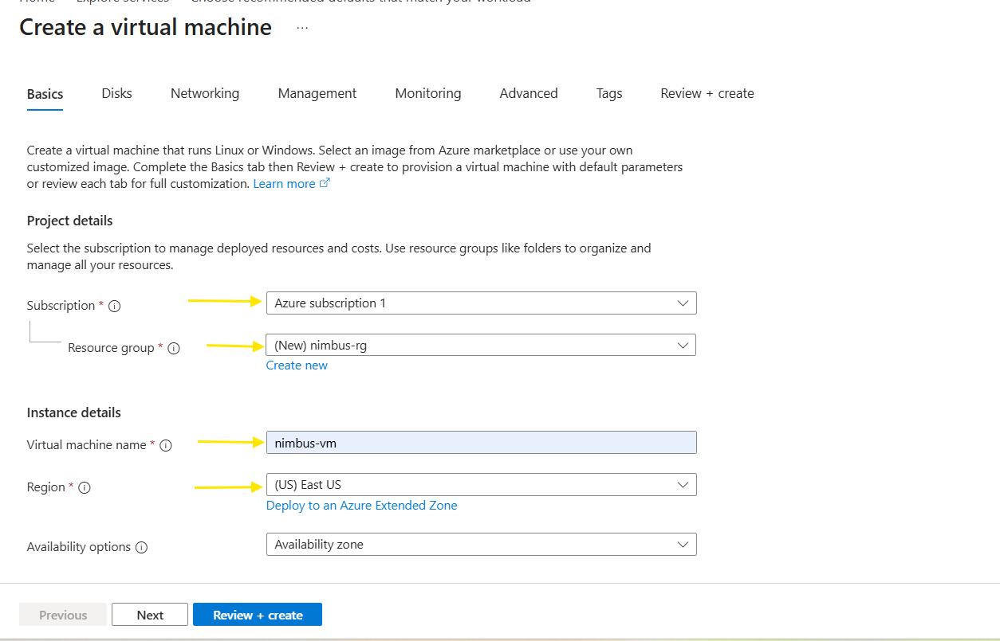

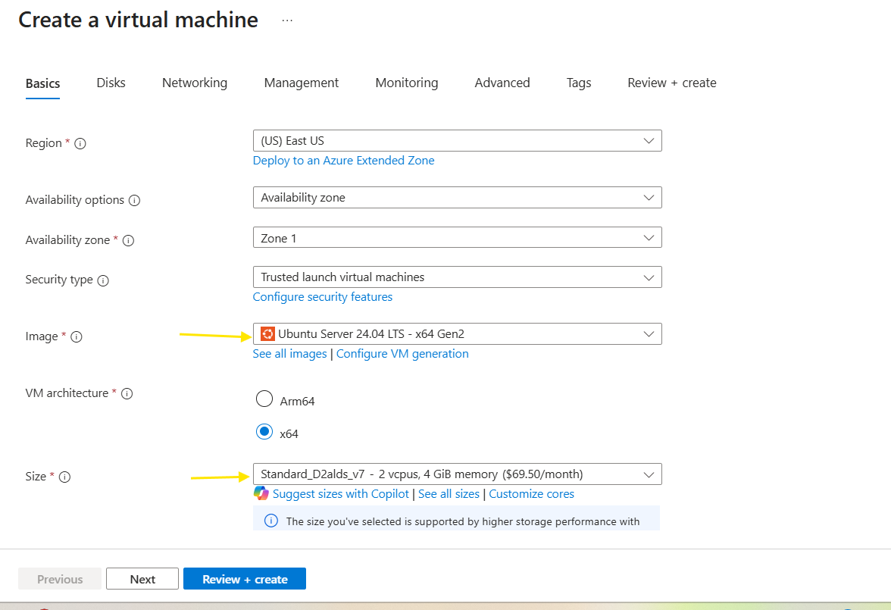

After the selecting all the required input then click ***"Review + Create"***

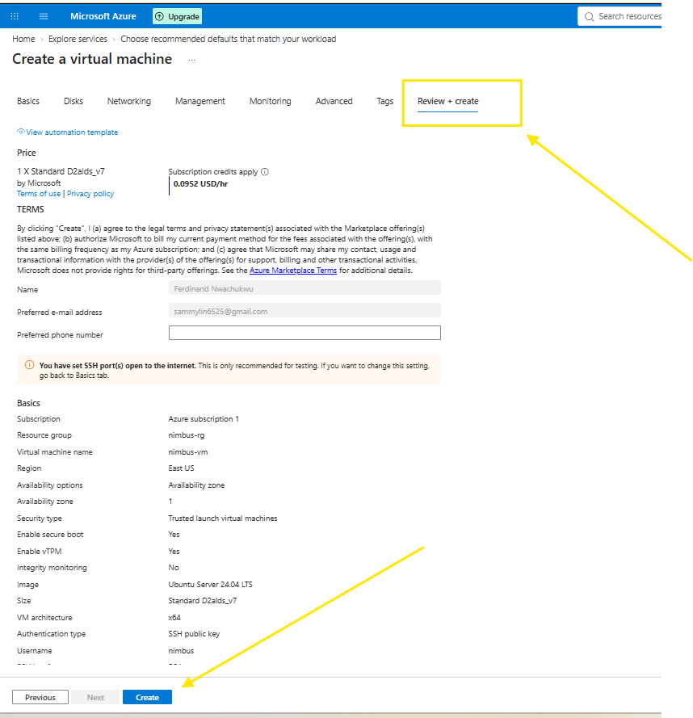

Immediately the create is clicked download download private key will display

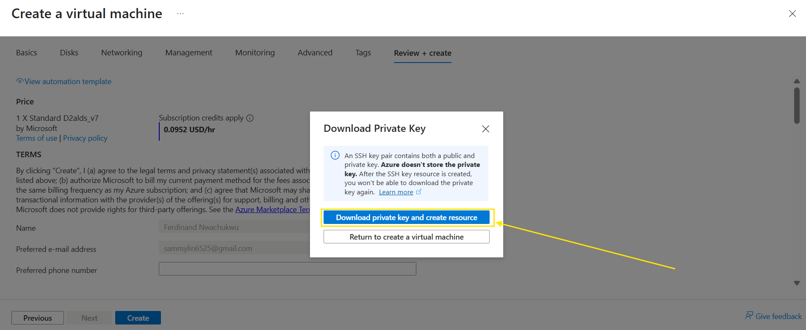

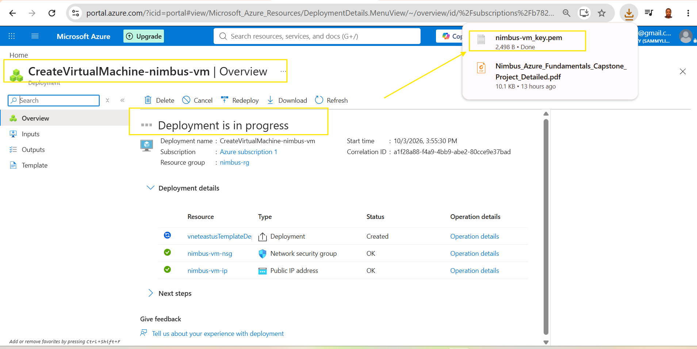

Then, click go to resources in the interface.

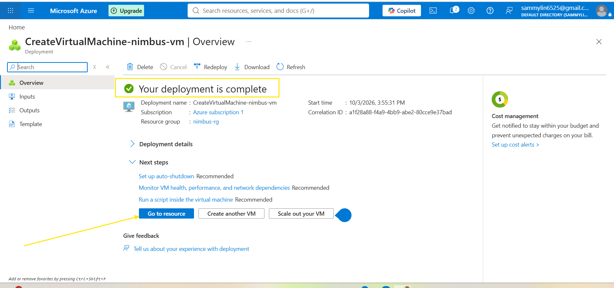

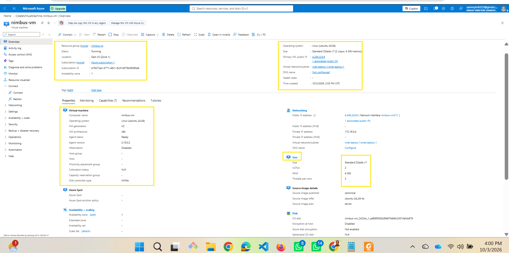

Click on the connect drop-down and select connect.

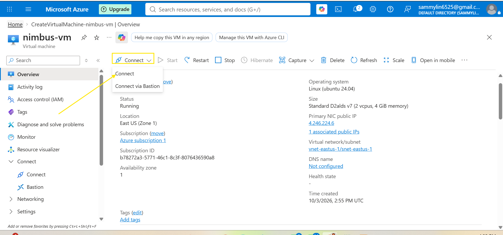

Click connect and link to connecting key link.

Copy the ssh key then go to the downloaded key path and open it in a powershell then paste the copied ssh-key from the linux resource.

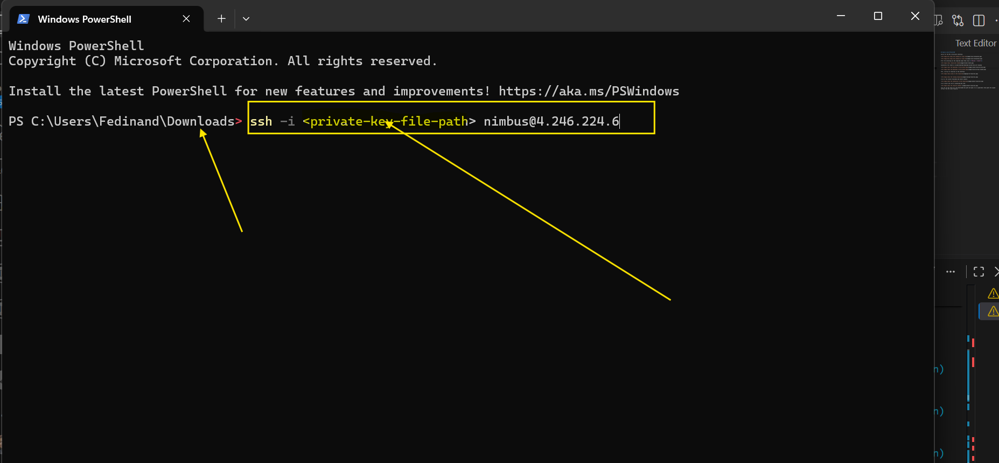

Replace file path-name with pem key name in the download folder

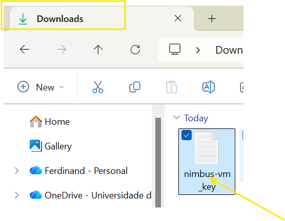

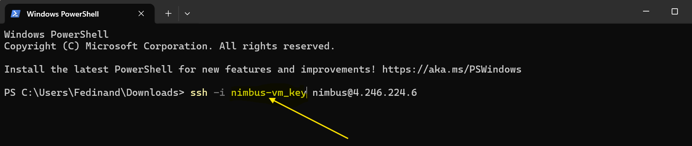

My first login encountered error as a result of not adding  ".pem" as the extension file.

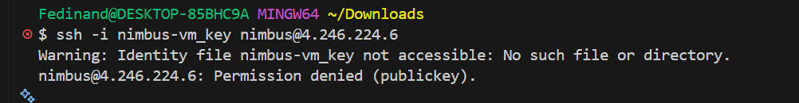

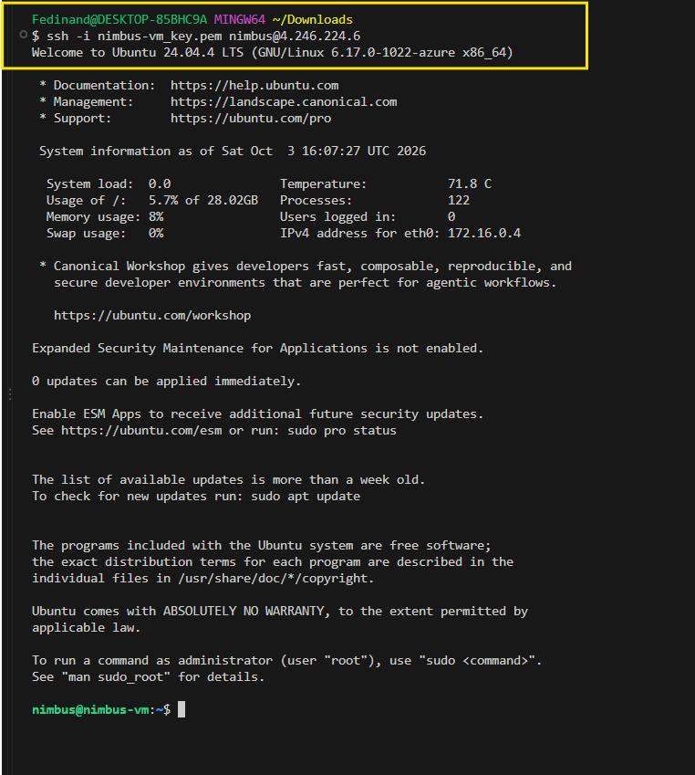

Below are some few commands run on linux

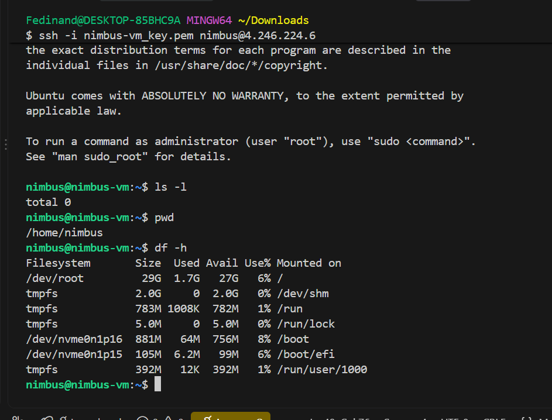