## How to Deploy window VM on the microsoft azure cloud.

**There are two common ways to connect (get into) a Microsoft Azure VM:**

1. RDP ***Remote Desktop Protocol*** — mainly for Windows VMs
Use Remote Desktop Connection on your computer.
Enter the VM's public IP address.
Sign in with the Windows username and password.

First you need to login into the microsoft azure platform, then search for virtual machine in the search box or select the virtual as shown in the image interface below.

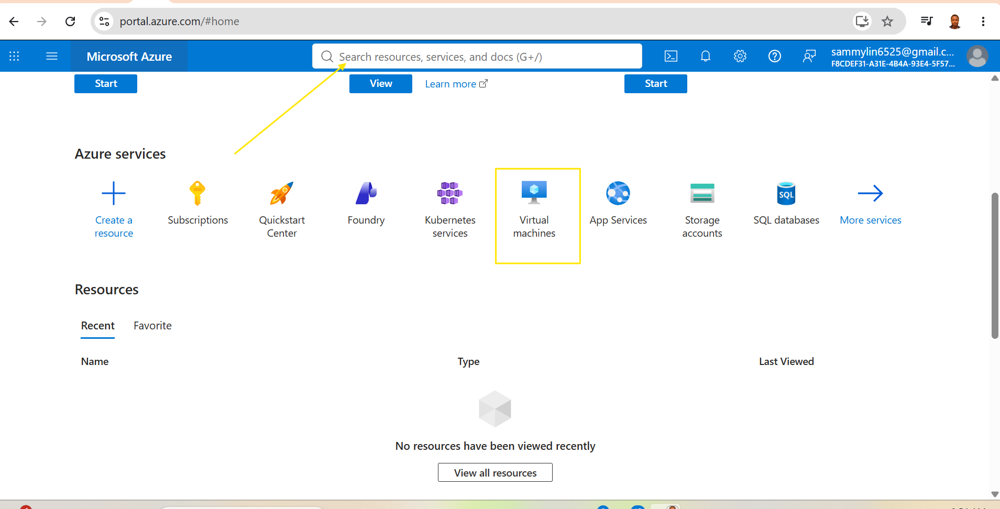

Follow the procedures in the Image below to create a window microsoft virtual machine.

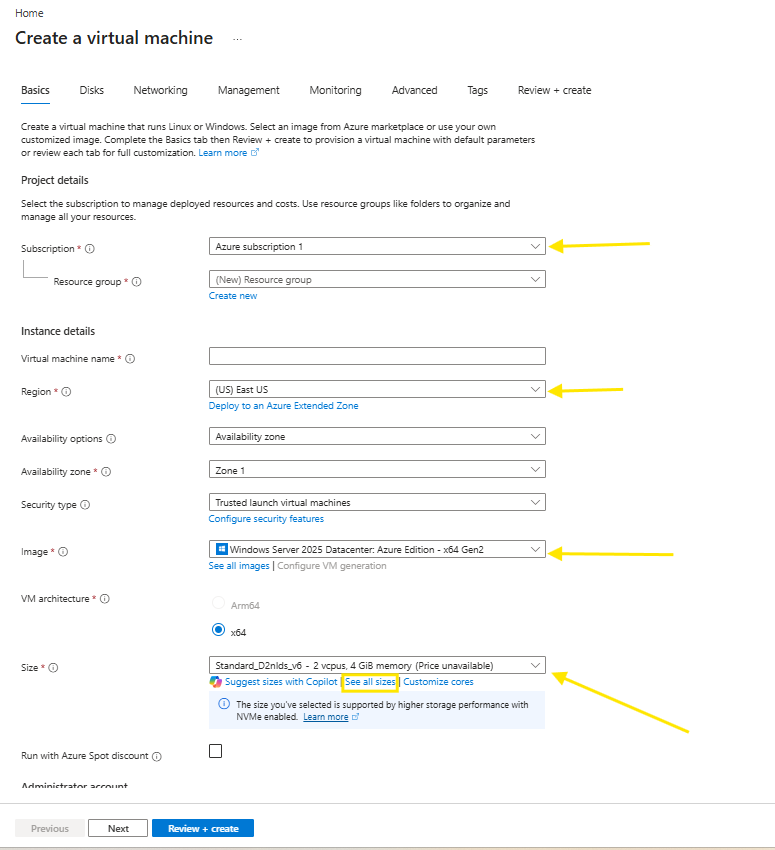

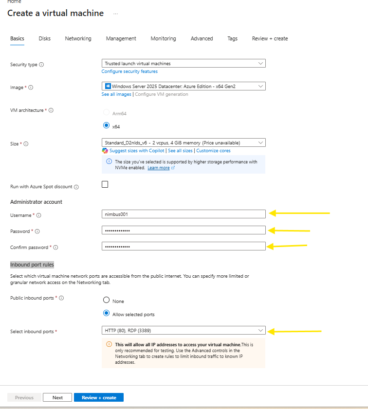

After the steps above, proceed, click review and create.

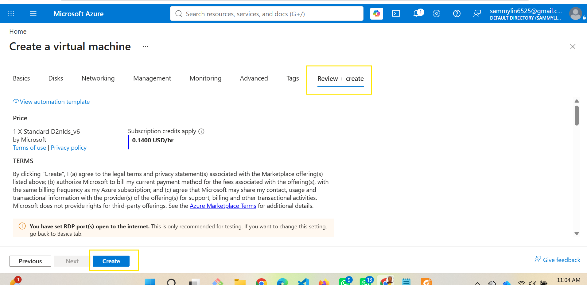

After the vm deployment completed, then **click** "go to resources"

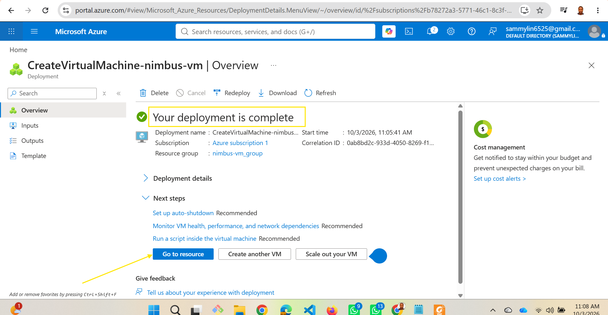

Below the Image is the view of the resources created

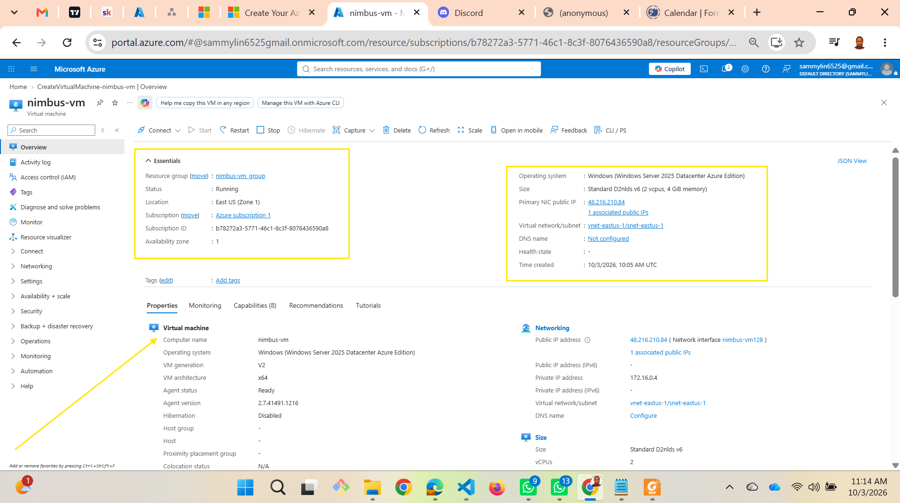

After creating the resource, select ***connect*** at the top left side of the screen and click ***connect***

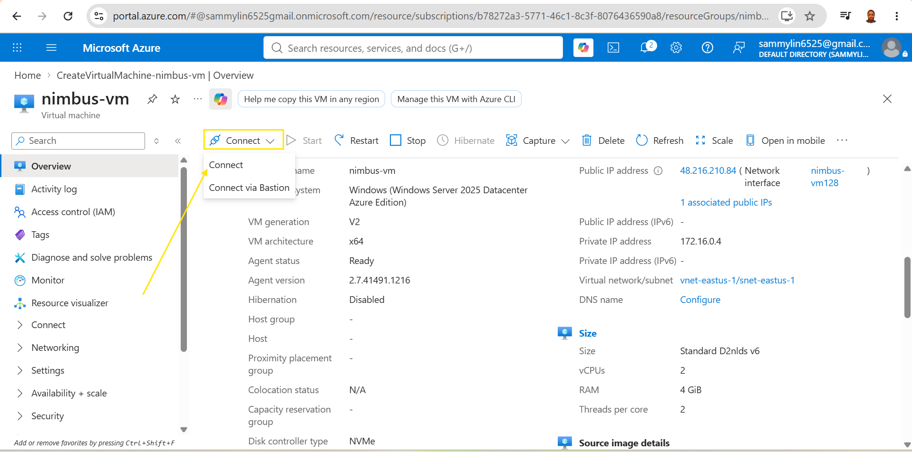

Connect will take you to another page then proceed by clicking ***Download RDP File***

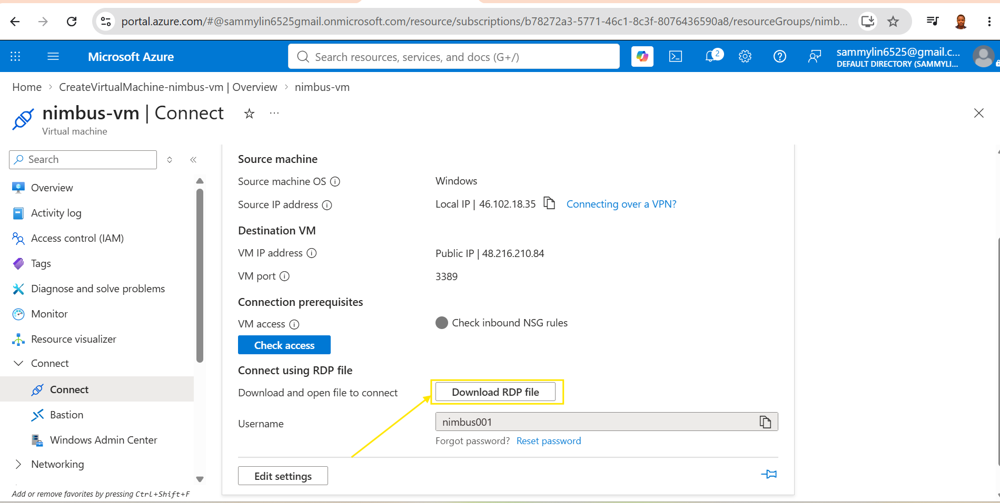

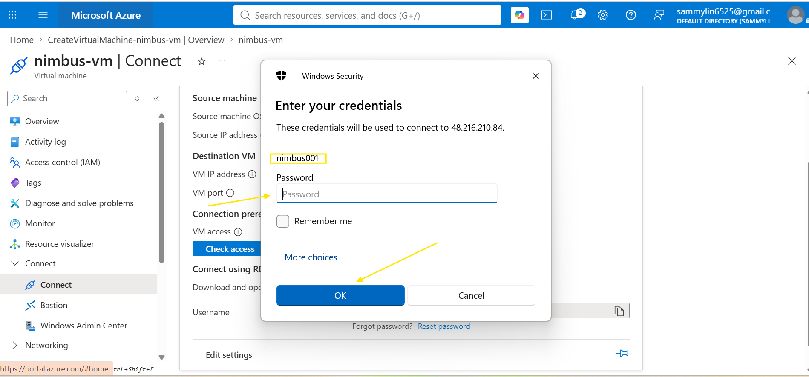

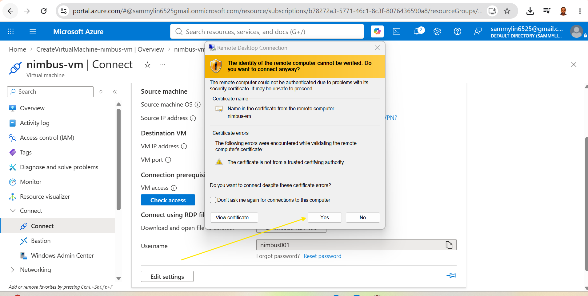

Window finally installed.

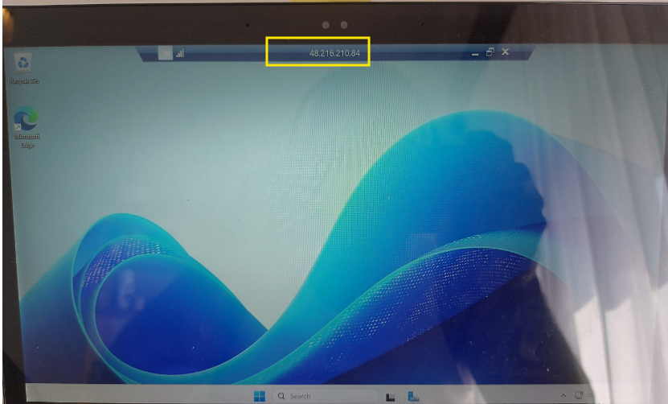

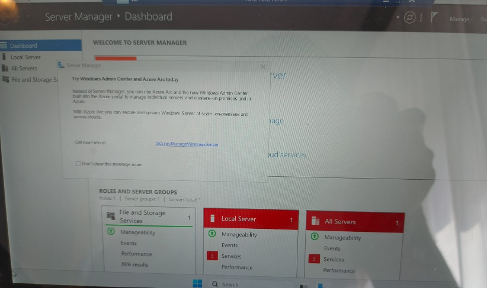

If you do not want to expose your IP, follow the alternative route on the Image below.

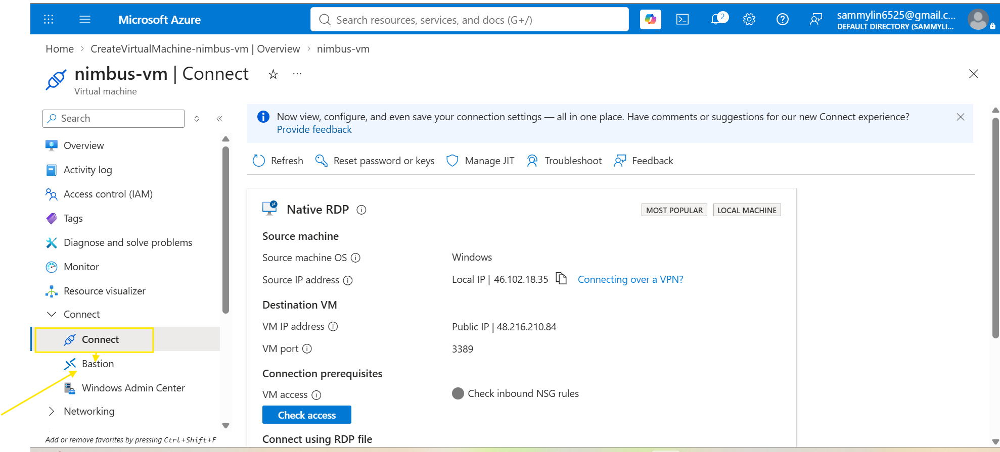

Finally all the running resources is here.

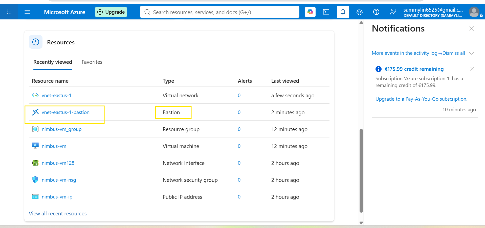

After installing and viewing  all the resources. Follow the process below to delete the created resources.

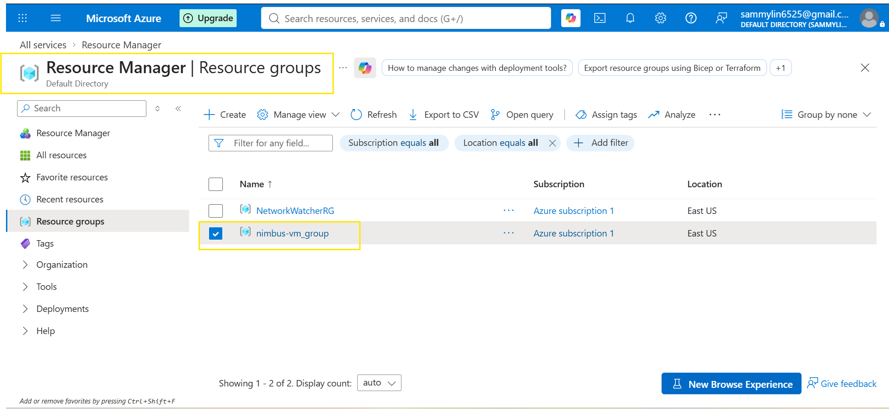

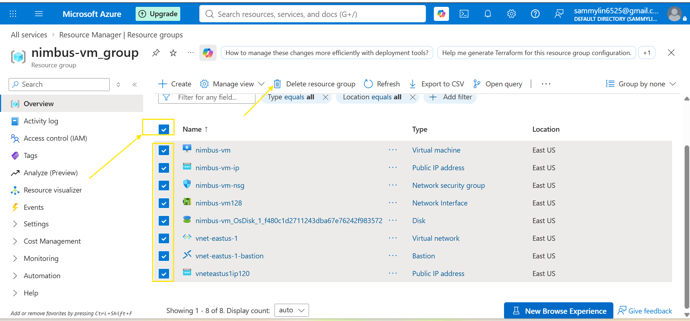

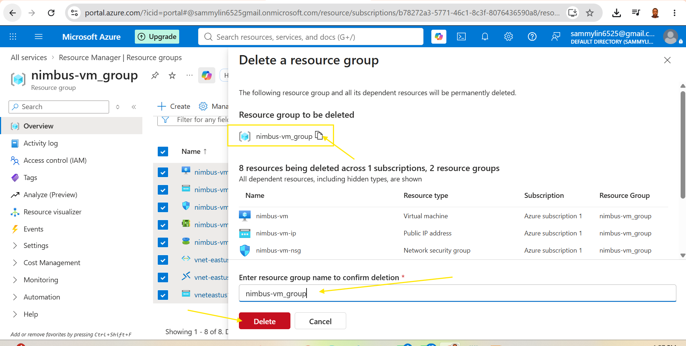

Simple ways to remember

VM                              Common Connection Method

🐧 Linux VM                         SSH

🪟 Windows VM                       RDP

updating the last file

2. SSH (Secure Shell) — mainly for Linux VMs

From your terminal:

ssh username@<public-ip-address>
You can authenticate using an SSH key or password, depending on how the VM was configured.

